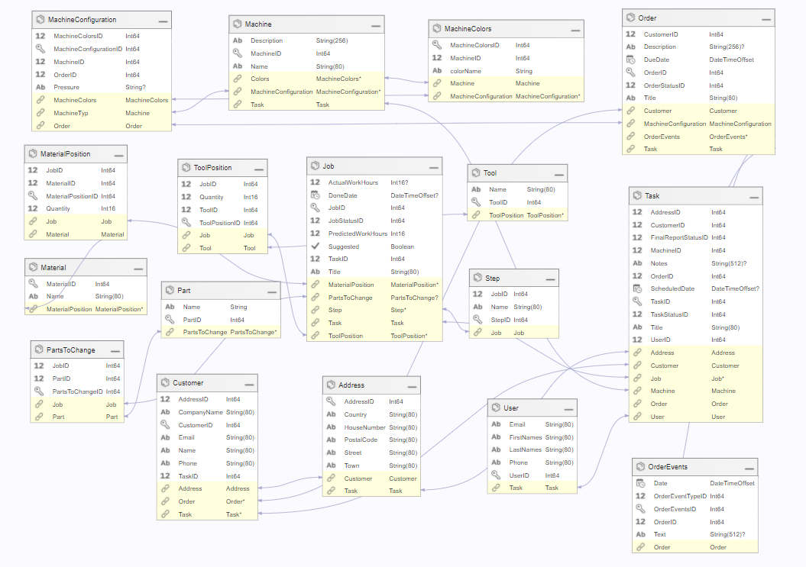
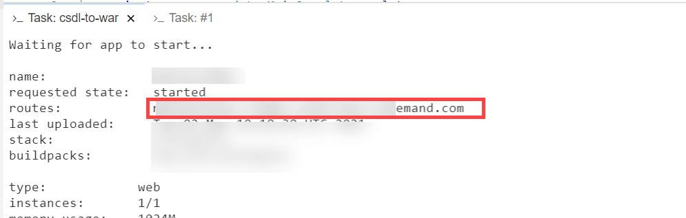
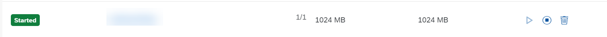
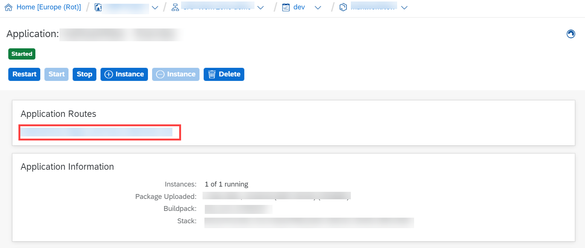

# Backend OData Service

## Overview

Mahlwerk Backend OData Service is a mobile-enabled OData service, generated for Mahlwerk's mobile solution. This OData service exposes the data used by our make-believe coffee manufacturer Mahlwerk.

## Architecture

Mobile Backend Tools (MBT) provide the capabilities to quickly build a mobile-enabled OData service that constitutes your mobile back-end service for mobile applications. It also automatically creates the necessary database tables in a database of your choice (H2, HANA or SQL based) based on the schema defined by you in metadata.csdl.xml file. 

Mahlwerk Backend OData Service is the backend server used by all the applications built for personas such as Salesperson, Customer, Technician etc. The OData service is used to develop Cross Platform & Native Applications. 

### Schema

## Setup & Run

1. Clone the GitHub repository into your Business Application Studio.
2. Inside the View menu click on Find Command and type MBT:Create tasks.json file.
3. After tasks.json file is created, again go inside View &rarr; Find Command and type Task: Run Task and select csdl-to-war. Your backend will be deployed.

### Find Route of your Backend

#### Method 1

When your backend is deployed look for **routes** in the terminal and copy the route.

Go into your browser, and type `https://<routes value you copied>` and hit Enter. You can see your odata backend service.

#### Method 2

In your BTP cockpit, go inside Global Account &rarr; Subaccount &rarr; Space and look for your deployed backend. 

Click on the backend and you will see a URL where your backend is deployed.

Click on the URL present in the Application Routes section to view your backend service.

© 2021 SAP SE

