# Salesperson App
This application is used by Mahlwerk Store's Sales Persons to place Orders on the Customer's behalf. The salesperson can scan the Machine's Barcode from the template and show the machine details to the customers. The salesperson can also add customers through this application.

## Overview
Mahlwerk Sales Person application is a cross platform mobile application built using SAP Mobile Development Kit.

## Architecture
This application fetches data using the OData end points form Mahlwerk's Mobile Backend. SAP Mobile Services handles the user Authentication and Identitiy management for this application

### MDK Client Version
MDK 6.1 or higher

## Setup & Run

#### Configure a new MDK application in Mobile Services cockpit
1. Navigate to [SAP Mobile Services cockpit](https://developers.sap.com/tutorials/fiori-ios-hcpms-setup.html).
2. On the home screen, select **Create new app**.
    
3. In **Basic Info** step, provide the required information and click **Next**.

    | Field | Value |
    |----|----|
    | `ID` | com.sap.mdk.salesperson |
    | `Name` | SAP MDK Demo App |

    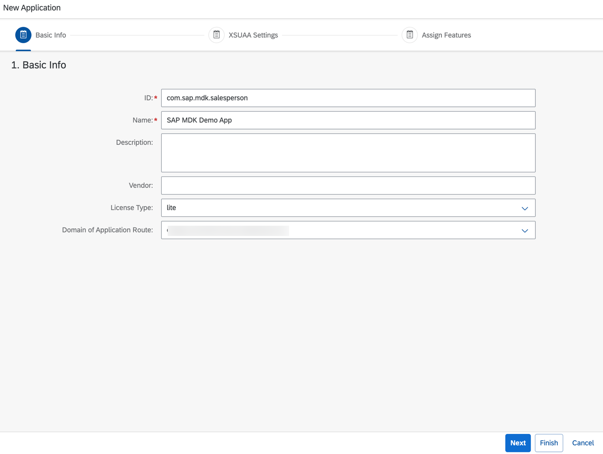

    > If you are configuring this app in a trial account, make sure to select **License Type** as *lite*.

4. In **Assign Features** step, choose **Mobile Development Kit Application** from the dropdown and then click **Finish**.

    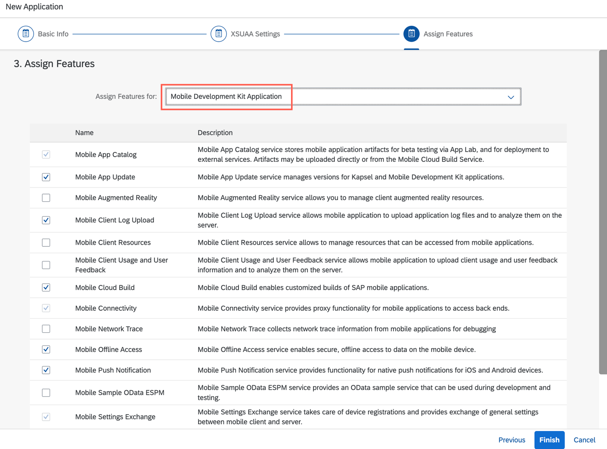

    >If you see a _Confirm Finish_ window, click **OK**.

    Once you have created your application, you see a list of default features have been automatically assigned to the app.

    

#### Create a new destination to your MDK Mobile application

1. Click **Mobile Connectivity**.  

    

2. Click the **Create** icon to add a new destination.

    

3. In **Basic Info** step, provide the required information and click **Next**.

    | Field | Value |
    |----|----|
    | `Destination Name` | Mahlwerk |
    | `URL` | Your backend OData Service URL generated in [previous exercise](/1_backend_odata_service) |

    

4. For this tutorial, there is no Custom Headers, Annotations required. Click **Next** to navigate to further steps.

5. Since the current implementation of the OData service doesn't provide any authentication, keep the default **SSO Mechanism** in **Destination Configuration** step as *No Authentication*, click **Next** and then click **Finish**.   

#### Clone Git repository in your SAP Business Application Studio space and deploy MDK project

1. Go to your SAP Business Application Studio space.

2. Clone git repository and upload this folder to SAP's Business Apllication Studio's workspace.

3. Right click `Application.app` in `2_salesperson_mdk_app` folder and select `MDK:Deploy`. 
    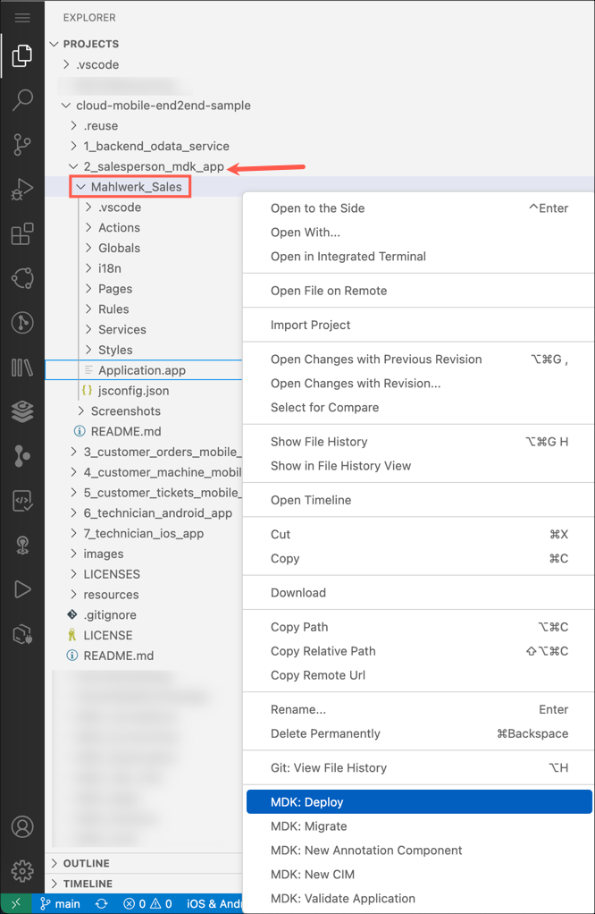

4. Select deploy target as **Mobile Services**.

   MDK editor will deploy the metadata to Mobile Services.

    

5. Select Mobile Services landscape, Application id of the application from Mobile services that you created in Mobile Services for this application.

 6. Wait for deploy to finish.

 #### Display the QR code for onboarding the Mobile app

 SAP Business Application Studio has a feature to generate QR code for onboarding the mobile app.

Click the `Application.app` to open it in MDK Application Editor and click **Application QR Code** icon.

 #### Test the application
1. **Download and install:** **SAP Mobile Services Client** on your [iOS](https://apps.apple.com/us/app/sap-mobile-services-client/id1413653544) or [Android](https://play.google.com/store/apps/details?id=com.sap.mobileservices.client) device (If you are connecting to `AliCloud` accounts then you will need to brand your [custom MDK client](cp-mobile-dev-kit-build-client) by allowing custom domains.)

2. Follow the steps to on-board the MDK client on [Android device](https://github.com/SAP-samples/cloud-mdk-tutorial-samples/blob/master/Onboarding-Android-client/Onboarding-Android-client.md) or [iOS device](https://github.com/SAP-samples/cloud-mdk-tutorial-samples/blob/master/Onboarding-iOS-client/Onboarding-iOS-client.md).

## Screenshots
*Coffee Machines* 

*Machine Details* 
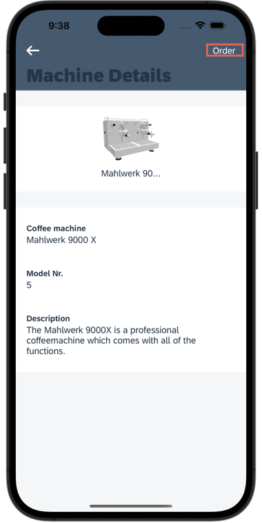
*New Order > Select a customer*
 
*Configuration > Select a color* 

*Configuration > Select the Max Pressure*
 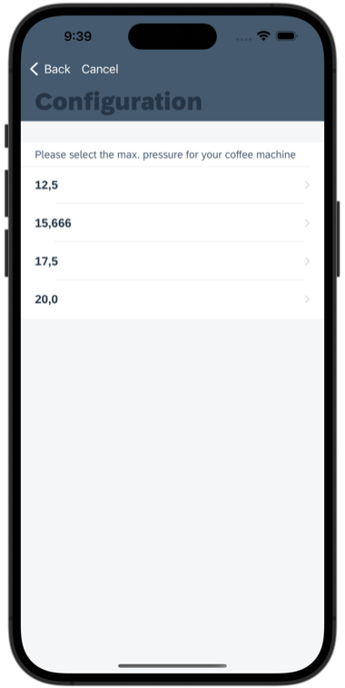
*Order Summary*
 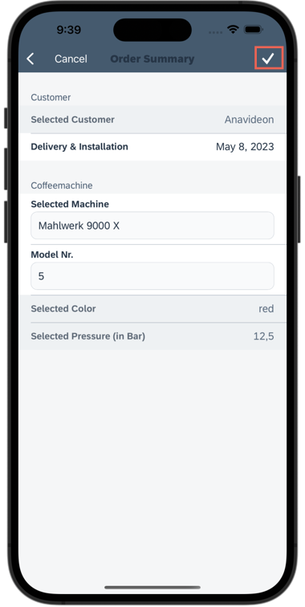
*Order being created*
 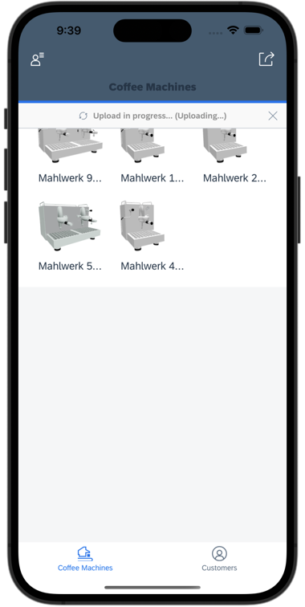
*Customers*
 
*Customer Details and Address*
 
*Customer Machines*
 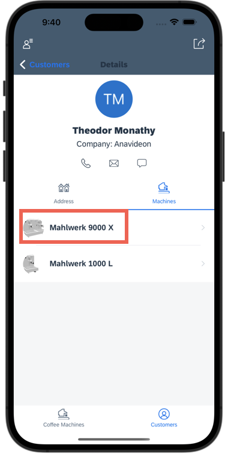
*Machine Details*
 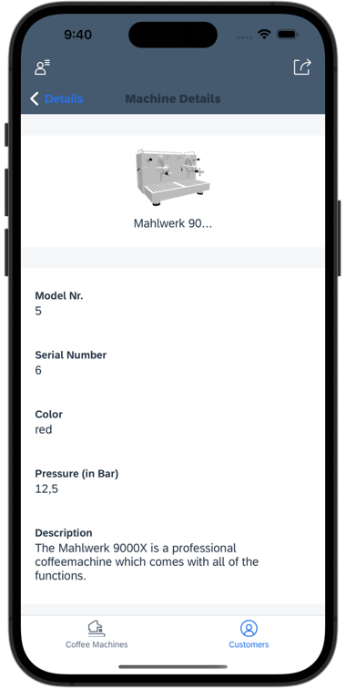
*User Settings*
 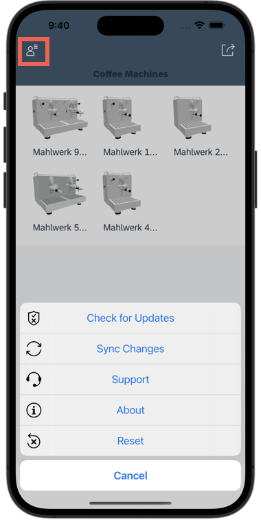
*User Actions*
 
*New Customer*
 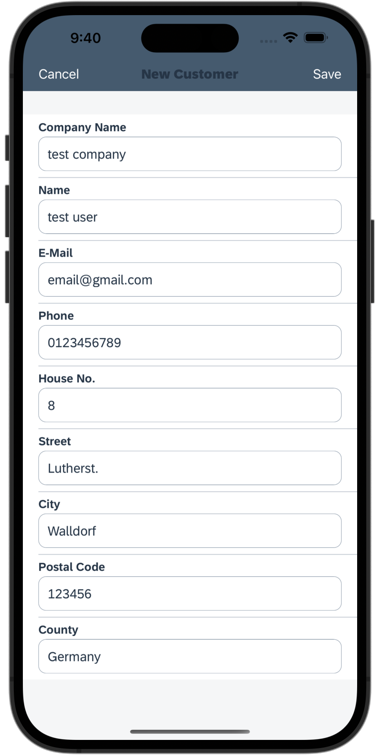
*Scan a barcode*
 

