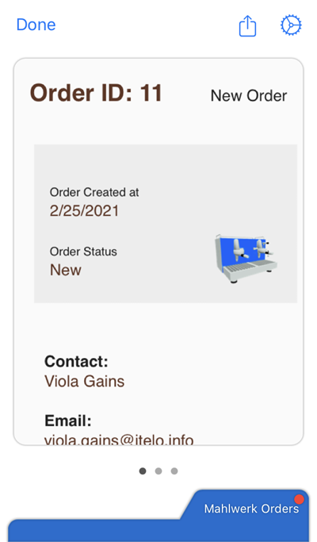

# Order App for Customer

## Overview

Mahlwerk Order Card gives you the details of the order Salesperson placed for you. You can see the order date, the status of your order, the image of the coffee machine you ordered and customer details.  The card also provides the capability to close the order once you receive the machine.

## Architecture

Mobile Cards is one of the offerings of SAP Mobile Services. It is a low code solution that helps businesses seamlessly mobilize their enterprise data. Using SAP Mobile Cards application you can see various cards showing different information to you in one app, that is, you don't have to download separate custom mobile applications.

See [Mobile Cards documentation](https://help.sap.com/doc/f53c64b93e5140918d676b927a3cd65b/Cloud/en-US/docs-en/guides/getting-started/mck/mck-overview.html) for details.

Mahlwerk Order Card is a SAP Mobile Card through which the customer can see their order's details on their device and can close a order when they receive their machine.
The card can be reused for any use case and to do so, you just need to update your backend destination.

## Prerequisites

[Trial Account on SAP BTP](https://developers.sap.com/tutorials/hcp-create-trial-account.html)

[Set up SAP Mobile Cards](https://developers.sap.com/tutorials/cp-mobile-cards-setup.html)

[Set up Business Application Studio for Mobile Development](https://developers.sap.com/mission.mobile-cards-develop.html)

## Setup and Run

1. Clone the GitHub repository into your Business Application Studio.
2. Open metadata.json in the code editor and change the Connection (line 4) to point to your destination.

    **NOTE:** To create a destination: In your mobile services cockpit, go inside SAP Mobile Cards &rarr; Features &rarr; Mobile Connectivity. Click on create button, add destination name and URL of your backend service, click Next and then click Finish. 

3. Deploy and publish your Card.
4. Open your SAP Mobile Cards application and subscribe to the Mahlwerk Order Card.

    **NOTE:** If the cards are not visible, then do a pull refresh to see them.

**For Android Device:**

5. Tap on expand action button and Tap on Close. Your Order will be closed.

**For iOS Device:**

5. Tap on actions menu and Tap on Close. Your Order will be closed.

## Screenshot

### Android

#### Front

### iOS

#### Front

© 2021 SAP SE

