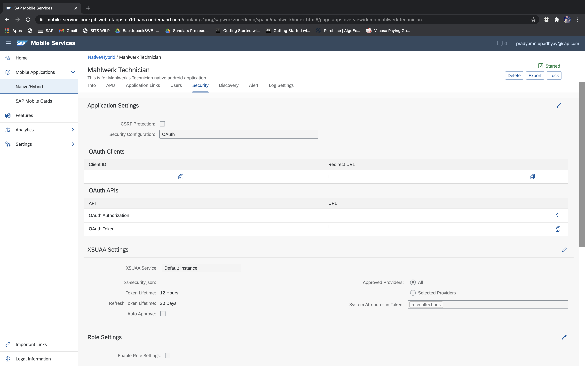
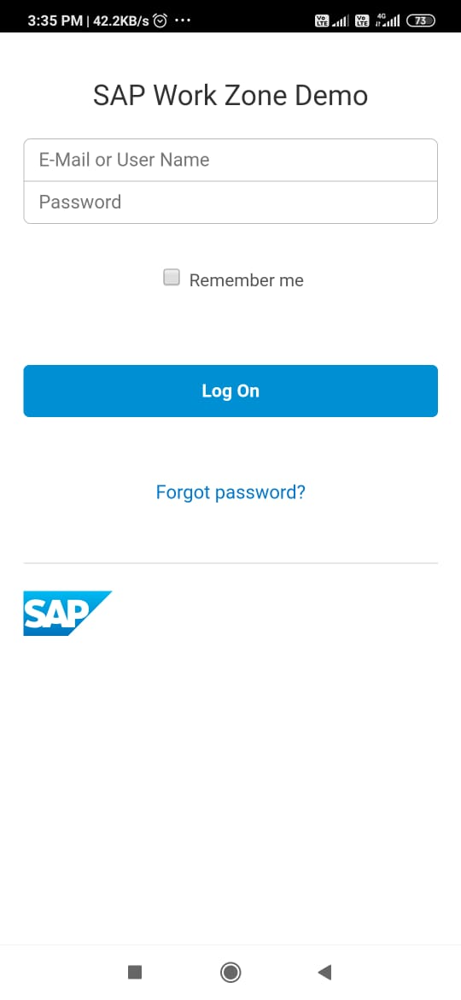
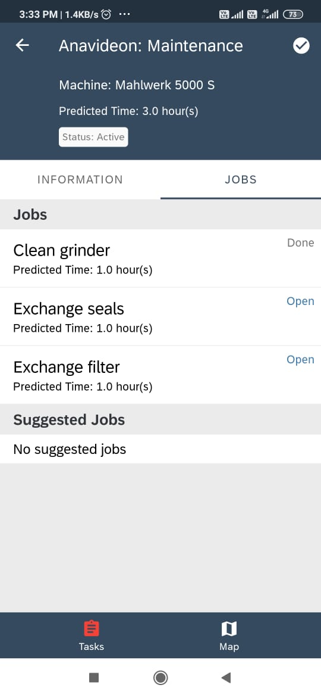

# MahlWerk-Android

## Overview 

This native android application is used by Mahlwerk's Technician. The technician uses this application to see the open tasks and assign them to themself. The technician can see the task details, customer details and navigate to the site using an inbuilt map.

This application consumes Mahlwerk's Backend's Odata Service for fetching the task details and for all of its operations. 
[Link to Mahlwerk's Backend](https://github.wdf.sap.corp/cloudplatform-mobileservices/Mahlwerk/tree/qual/1%20Backend%20OData%20Service) 

## Architecture

- This application uses *One Activity - Many Fragments* to display & control the User Interface. 
- *MVVM*(Model-View-ViewModel) Design Pattern has been used to make sure the UI remain consistent with the application's data. 
- Android's Architecture components like Navigation Controller, ViewModel, Lifecycle Observer to handle the method callbacks, maintaining real-time UI state. 
- *SAP's Mobile Services Android SDK* is used for User Authentication, Fiori Views, Onboarding, In-app Map and Offline Data Sync. 

# Setup & Run

*Minimum SDK Version = 26
 and Target SDK Version = 29*

1. Clone the GitHub repository into a folder on your system. Goto Android Studio -> Import Project from Gradle file-> Browse to the Technician Android folder. 

2. Change the App ID to the application ID in Mobile services cockpit, in MahlwerkApplication.kt (inside app) & in SAPServiceManager.kt (inside service).
 - *Mobile Services Cockpit - Copy the App ID*

- Paste the App ID into the highlighted place in *MahlwerkApplication.kt* file.

- Paste the App ID into the highlighted place in *SapServiceManager.kt* file.

3. Copy the *App Id* (from last step) & *Server URL* (from API Tab) from mobile services cockpit and paste it in configurationprovider.json(inside res/raw).
- Copy *Server URL* from Mobile Services Cockpit API Tab*

- Paste the Server URL( into ServiceURL field ) and APP Id into *configurationprovider.json* file.

4. Change the *Redirect URL, Authorization End Point, Client Id, Token EndPoint* to your Application credentials in Mobile Services Cockpit. 
- Copy the *Client ID, Redirect Url, OAuth Authorization URL, OAuth Token URL* from the Mobile Services Cockpit Security Tab.

- Paste these credentials in *SAPOAuthConfigurationProvider.kt* file.
- Redirect URL in *OAUTH_REDIRECT_URL*
- Client Id in *OAUTH_CLIENT_ID*
- OAuth Authorization URL in *AUTH_END_POINT*
- OAuth Token URL in *TOKEN_END_POINT*

5. Change the *Service URL* in *app_restrictions.xml* in *app/src/main/res/xml* .

6. [Generate MAPS API key](https://developers.google.com/maps/documentation/android-sdk/get-api-key) first and then paste your *Google Maps API key* in the Manifest file for In-apps Map to work.

    - Get your Google MAPS API Key from Google Cloud Platform and Put he API_Key in *AndroidManifest.xml file* .

# Scrrenshots

© 2021 SAP SE

