# Mahlwerk - Technician iOS App

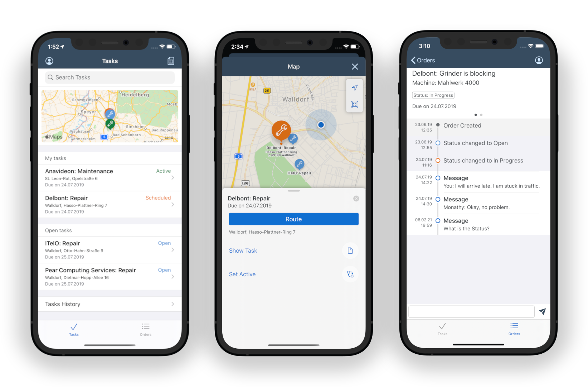

## Overview

This native iOS application is used by Mahlwerk's Technician to view and process various tasks.  

This application consumes Mahlwerk's Backend's Odata Service for fetching the task details and for all of its operations.

## Architecture

- *SAP BTP SDK for iOS* is used for User Authentication, Fiori UI Controls, Onboarding and Offline Data Synchronization.

## Build Setup

- Install [Cocoapods](https://cocoapods.org/) dependency manager.
- Install Apple Xcode IDE.
- Clone the repository and run `pod install` in this directory.
- [Configure your machine](https://github.com/SAP-samples/cloud-sdk-ios-specs#obtaining-technical-user--password) for securely downloading the SAP BTP SDK for iOS frameworks
- Open `Mahlwerk.xcworkspace` in Xcode.

### Configure App to your Mobile services Credentials

- Copy the *App ID* from Mobile services cockpit:
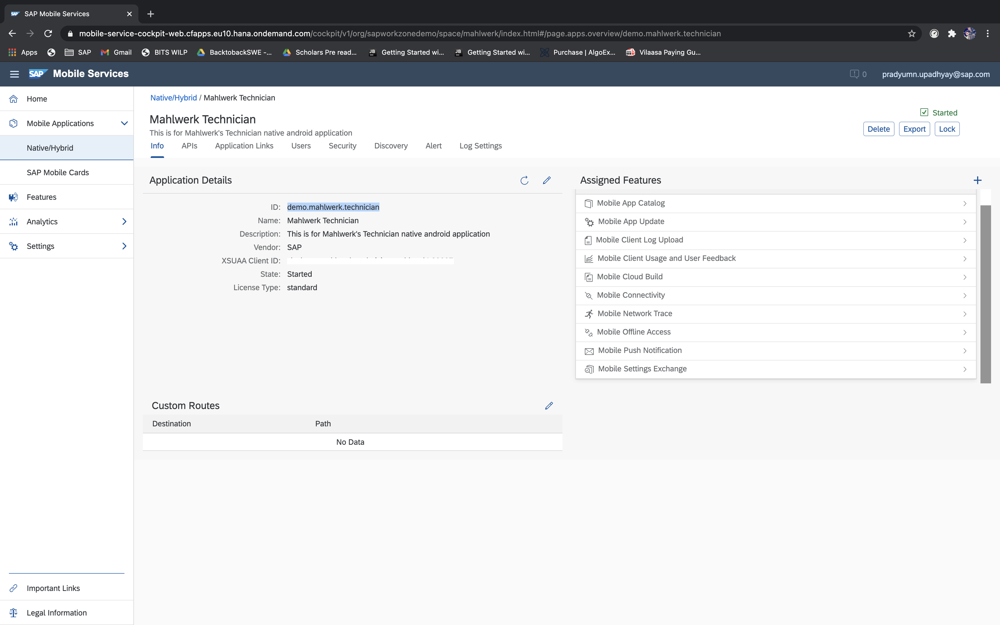

- Put the *App ID* into the highlighted place in *OnboardingFlowProvider.swift*:
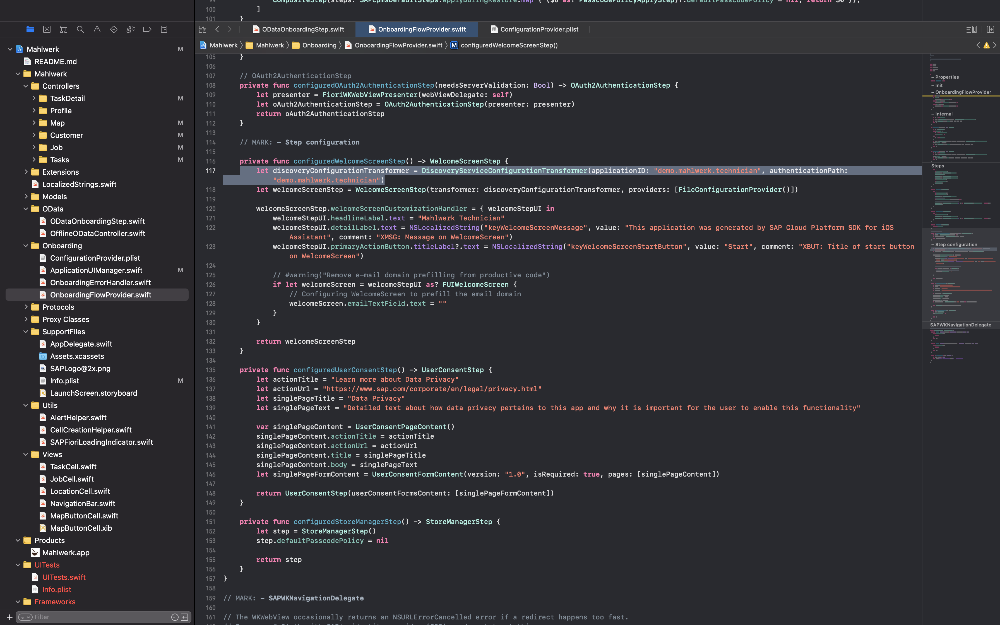

- Copy the *App Id* (see first step) & *Server URL* (from API Tab) from Mobile services cockpit and paste it in *ODataOnBoardingStep.swift*.
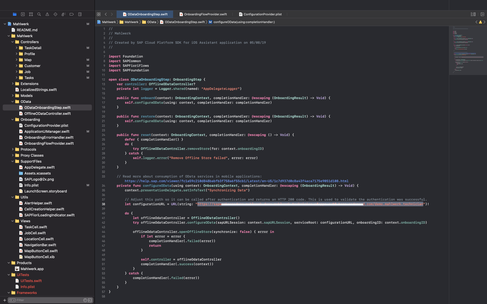

- Change the *AppId, Redirect URL , Authorization End Point, Client Id, Token EndPoint* to your Application credentials in Mobile Services Cockpit.
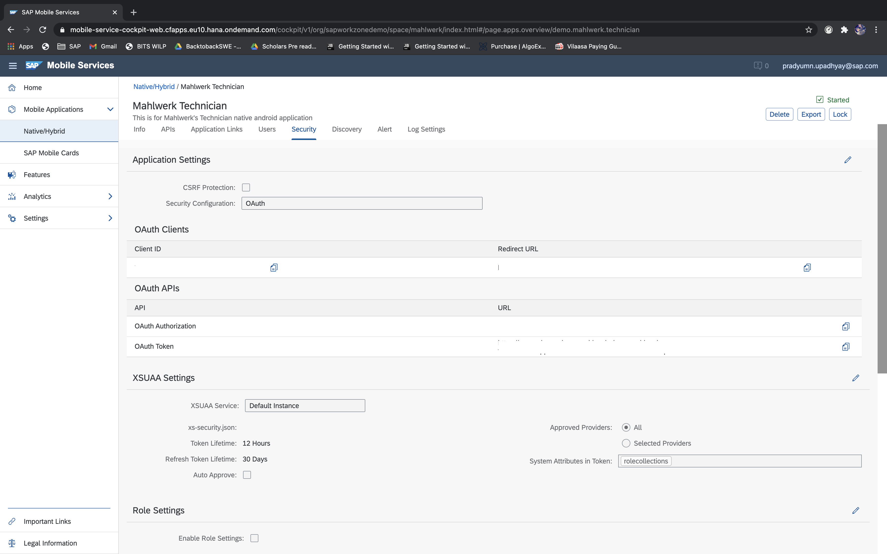

- Copy *Client ID, Redirect Url, OAuth Authorization URL, OAuth Token URL* from Security Tab in SAP Mobile Services cockpit.

- Paste these credentials in *ConfigurationsProvider.plist* file
- Redirect URL in *OAUTH_REDIRECT_URL* & *endUserUI*
- Client Id in *OAUTH_CLIENT_ID*
- OAuth Authorization URL in *AUTH_END_POINT*
- OAuth Token URL in *TOKEN_END_POINT*

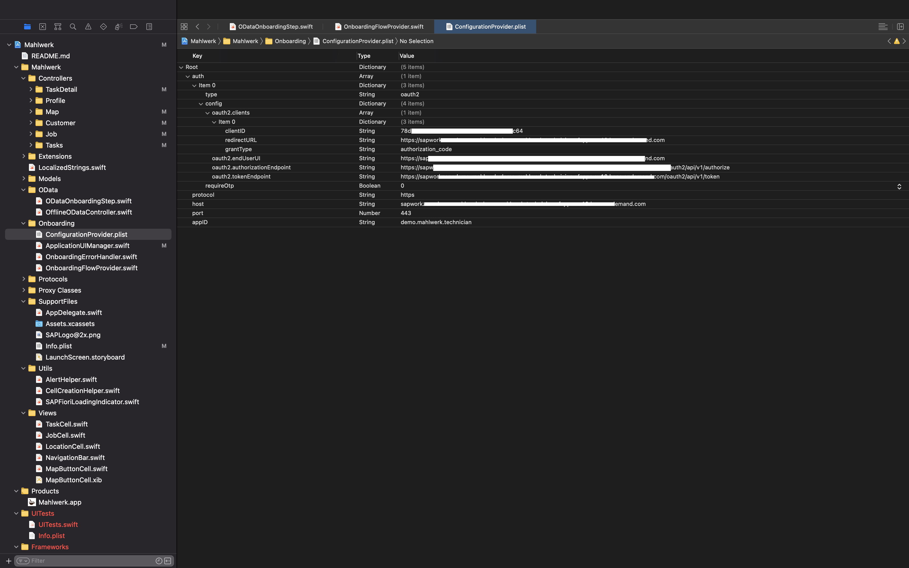

## Screenshots

  <b>Browse different tasks:</b> 
  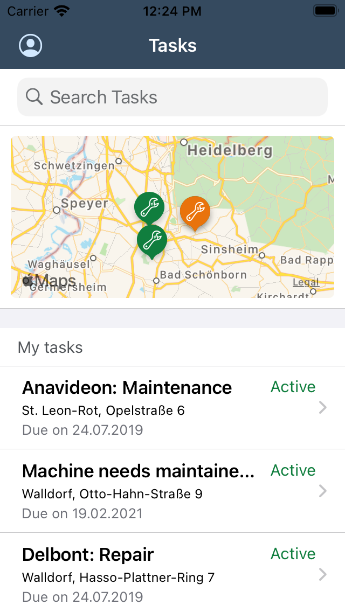

  

  <b>View task details:</b> 
  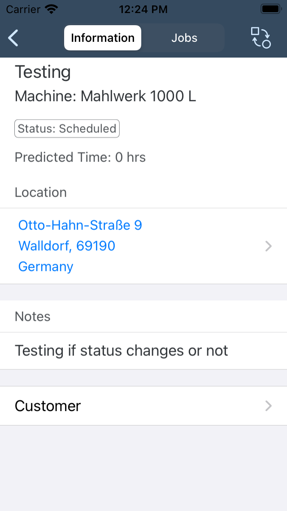

  

  <b>Update task status:</b> 
  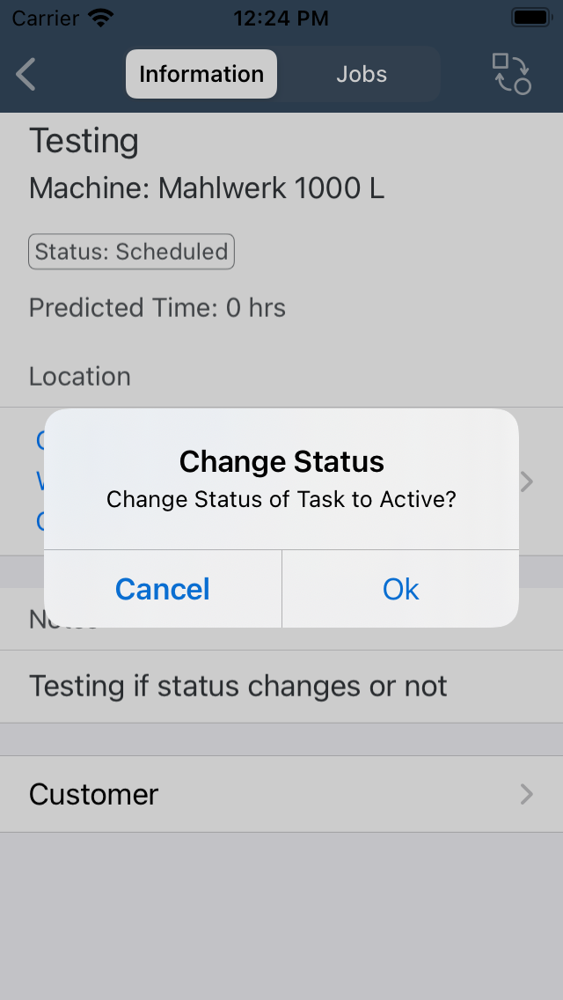

  

  <b>View location of task:</b> 
  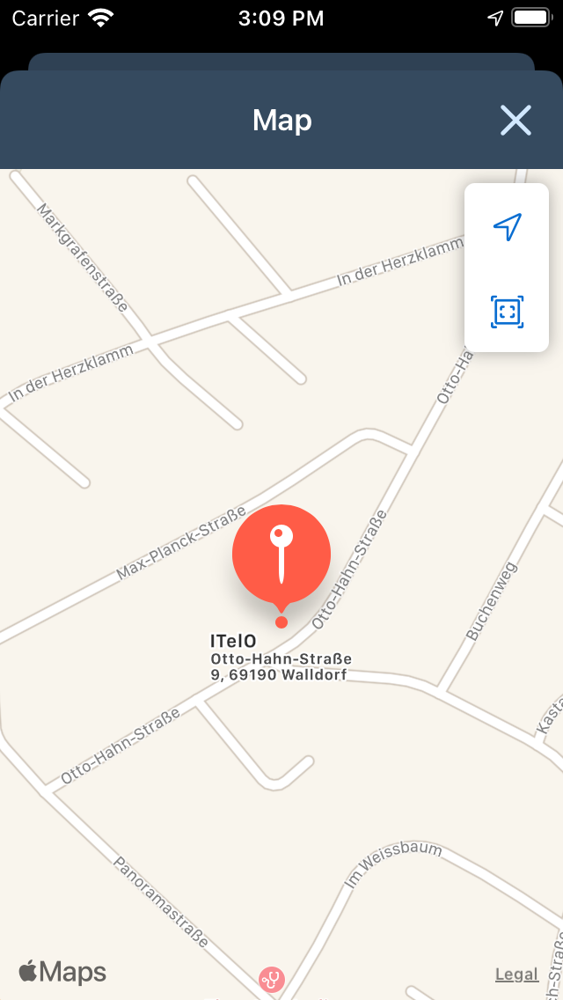

  

  <b>View locations of all tasks:</b> 
  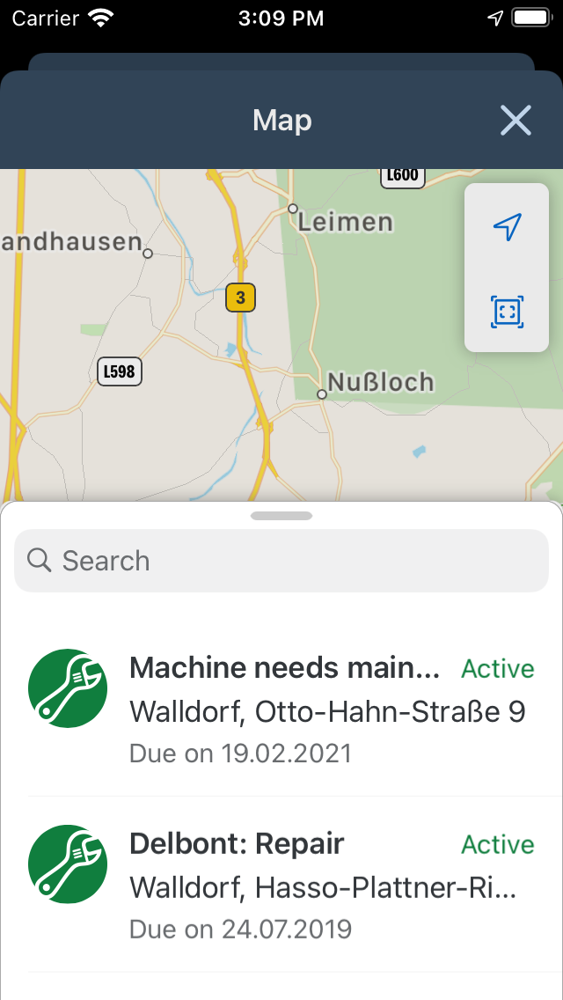

  

  <b>View customer details:</b> 
  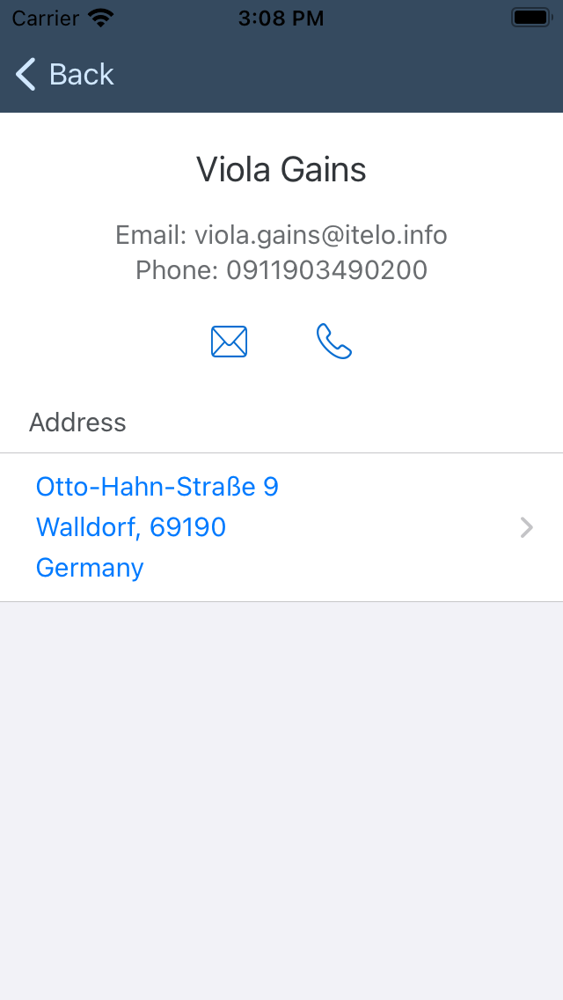

