# Mahlwerk - iOS Application for Service Technicians

## Overview 

This native iOS application is used by Mahlwerk's Technician. 

This application consumes Mahlwerk's Backend's Odata Service for fetching the task details and for all of its operations. 

## Architecture

- *SAP's Mobile Services Android SDK* is used for User Authentication, Fiori Views, Onboarding, In-app Map and Offline Data Sync. 

## Build Setup
- Install the [SAP Cloud Platform SDK for iOS](https://developers.sap.com/tutorials/fiori-ios-hcpms-install-sdk.html) version 5 or newer.
- Clone this repository and execute `sh scripts/refreshframeworks.sh` in the root directory.
- Open `Mahlwerk.xcodeproj` in Xcode.

## Configure App to your Mobile services Credentials

-  Change the App ID to the application ID in Mobile services cockpit, in *OnboardingFlowProvider.swift* 

- Change the App ID into the highlighted place in
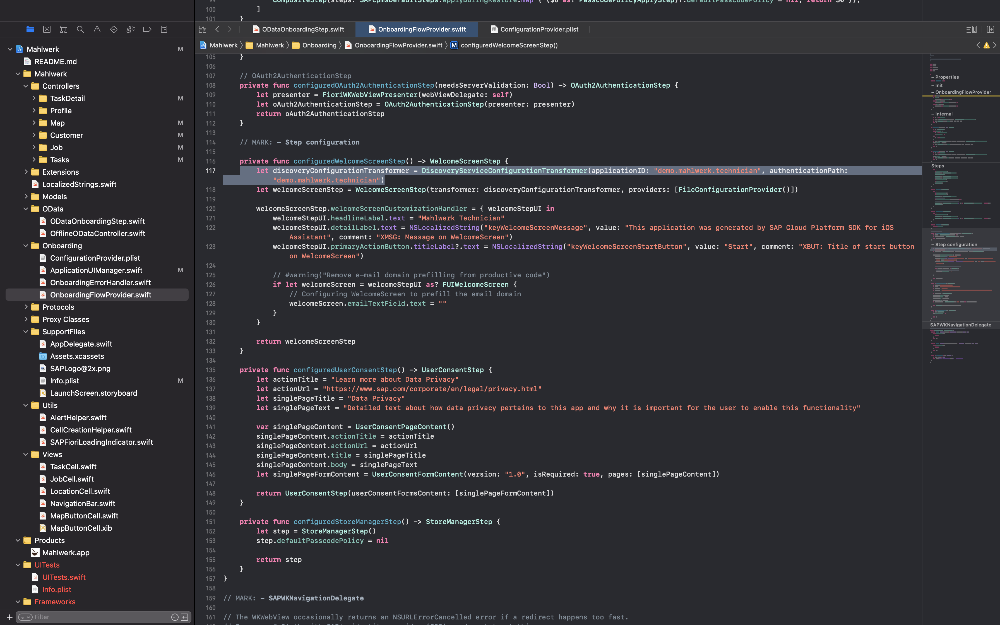

- Copy the *App Id* (from last step) & *Server URL* (from API Tab) from mobile services cockpit and paste it in *ODataOnBoardingStep.swift*.
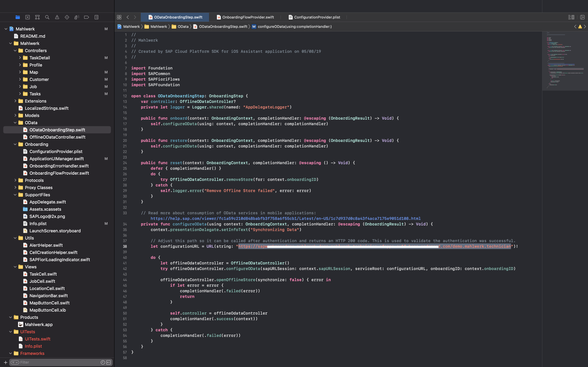

- Change the *AppId, Redirect URL , Authorization End Point, Client Id, Token EndPoint* to your Application credentials in Mobile Services Cockpit. 
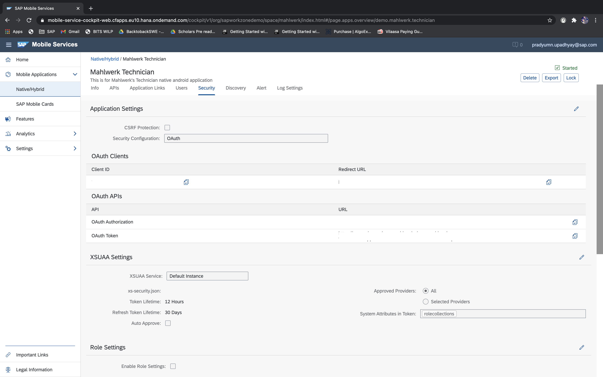

- Copy the *Client ID, Redirect Url, OAuth Authorization URL, OAuth Token URL* from the Mobile Services Cockpit Security Tab.

- Paste these credentials in *ConfigurationsProvider.plist* file
- Redirect URL in *OAUTH_REDIRECT_URL* & *endUserUI*
- Client Id in *OAUTH_CLIENT_ID*
- OAuth Authorization URL in *AUTH_END_POINT*
- OAuth Token URL in *TOKEN_END_POINT*

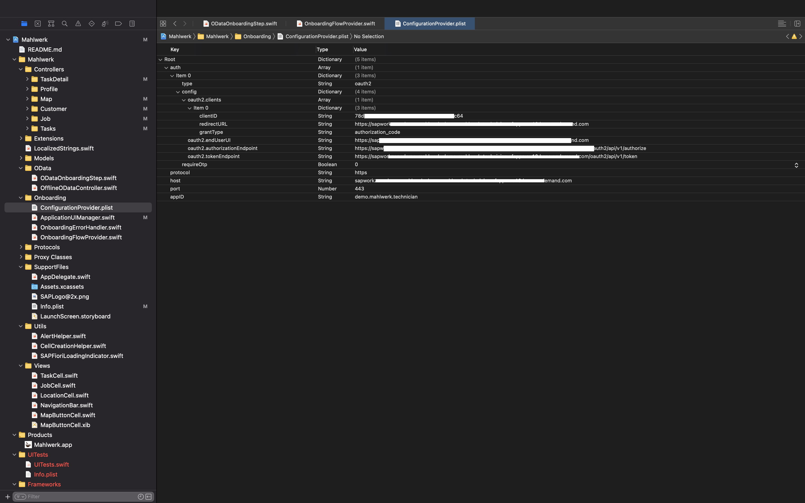

## Screens
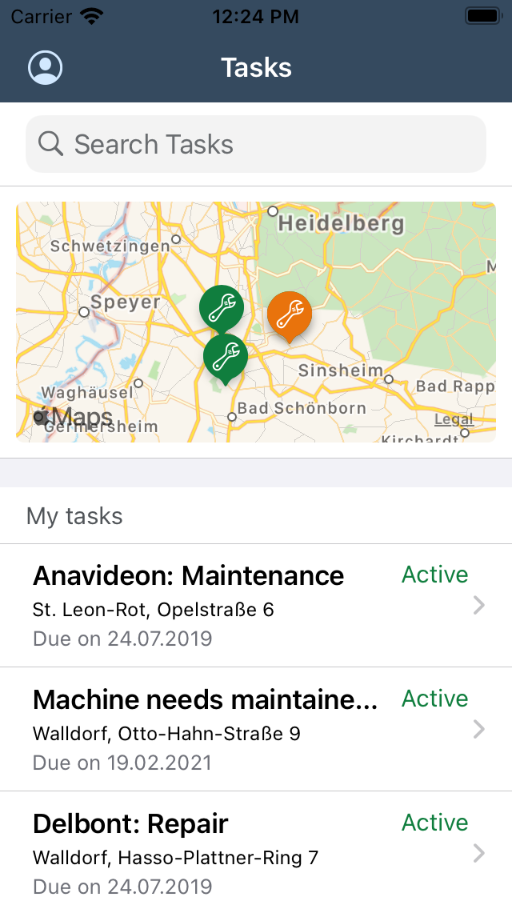
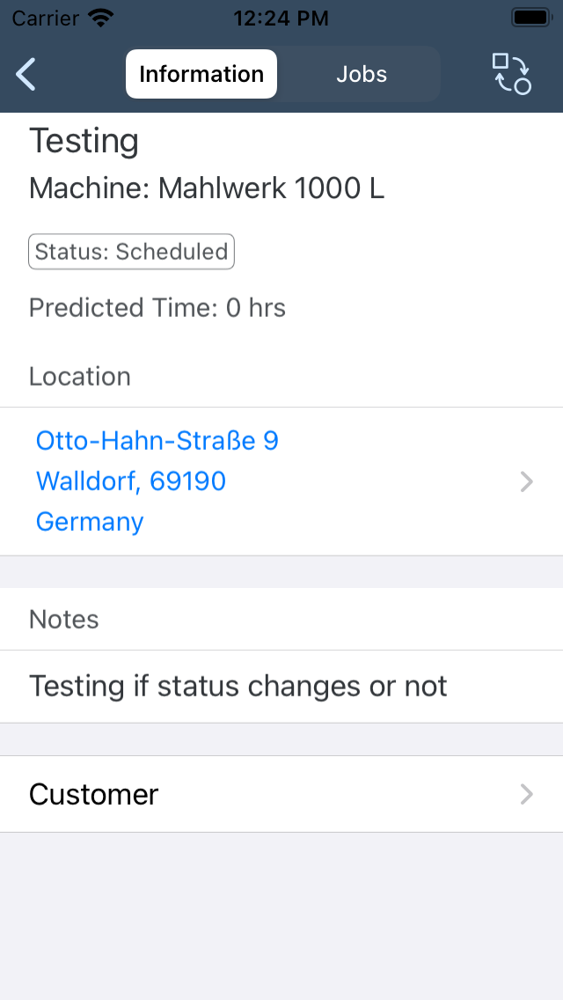
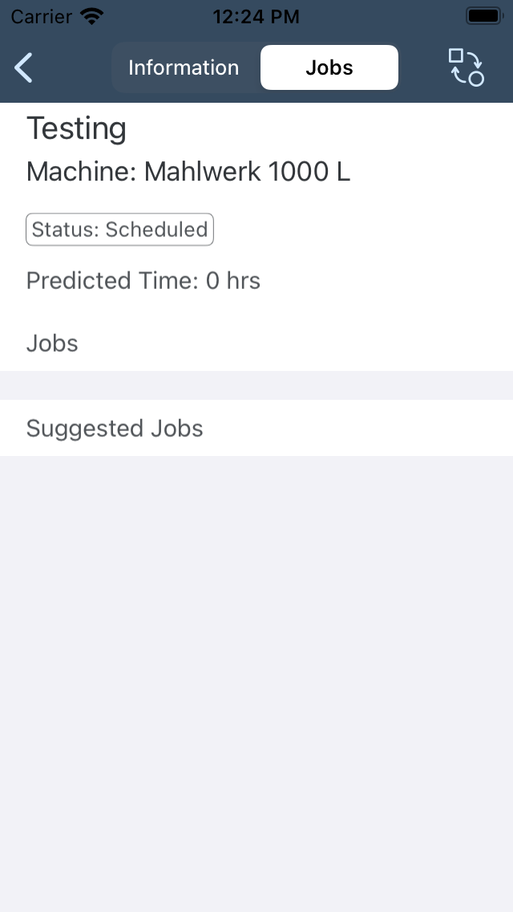
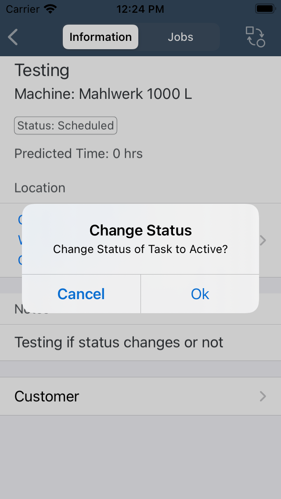
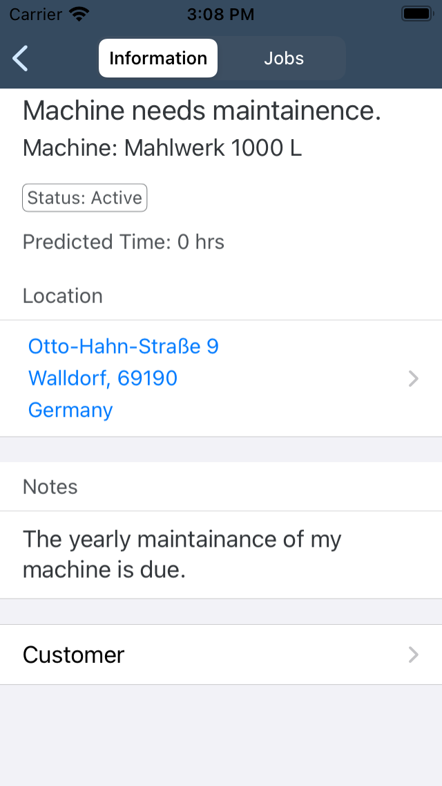
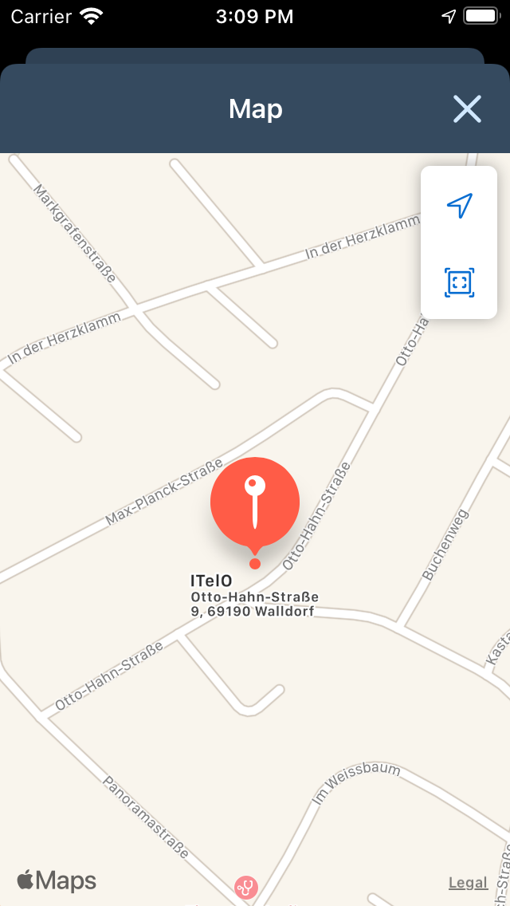
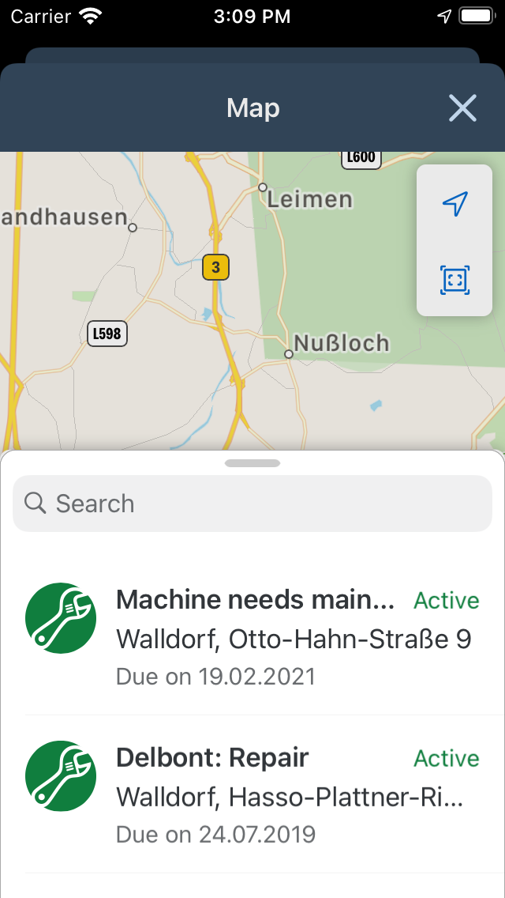
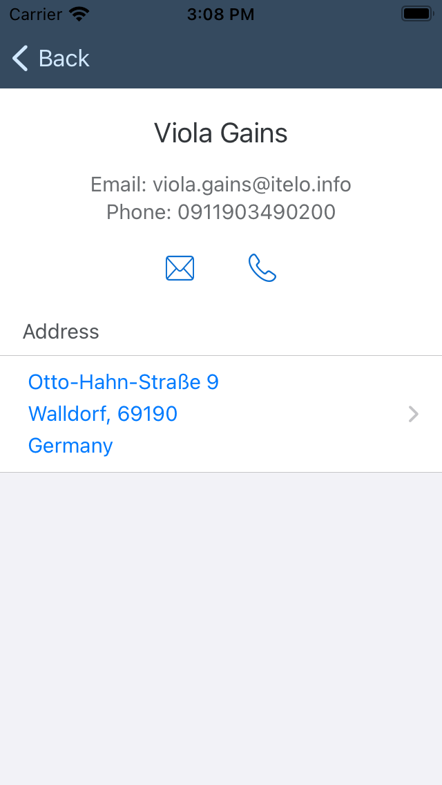
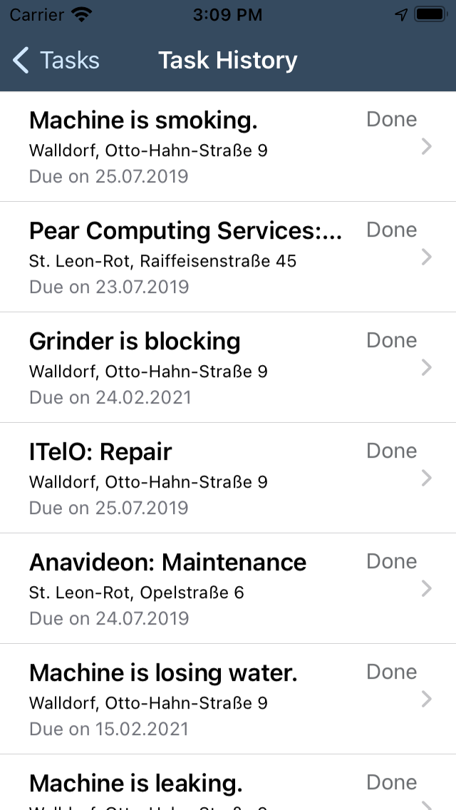
