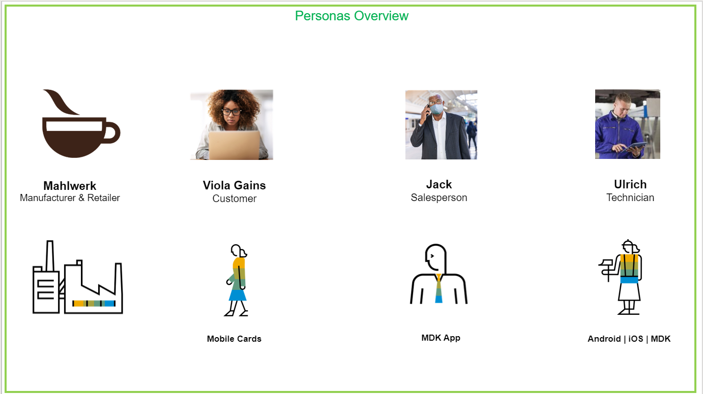
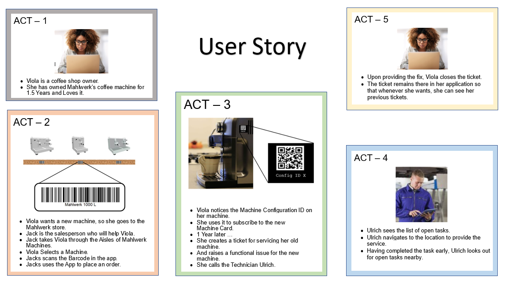
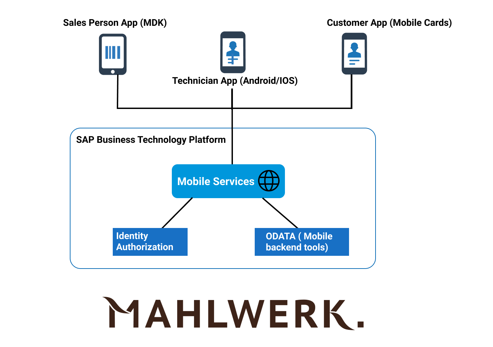

# Mahlwerk: Cloud Mobile End-to-End Sample

## Description

SAP Mobile Services provides multiple offerings for you to mobilize your data. However, when the options are aplenty, choosing the correct offering becomes crucial. Thus, we have defined a custom use case and built mobile solutions using all of our offerings. Experiencing these applications on your own devices will help you identify the right product for you.

### Use Case

Mahlwerk is a coffee machine vendor and sells the machines through retail stores. Mahlwerk wants to use mobile technologies to coordinate its services with the customer, salesperson, and technician.

#### Personas Overview

#### User Stories

#### Architecture

## Prerequisites

1. [Account on BTP Trial](https://developers.sap.com/tutorials/hcp-create-trial-account.html)
2. [Access SAP Mobile Services](https://developers.sap.com/tutorials/fiori-ios-hcpms-setup.html)
3. [Download Android SDK for SAP BTP](https://developers.sap.com/tutorials/cp-sdk-android-wizard-app.html)
4. [Set Up iOS SDK for SAP BTP](https://developers.sap.com/group.ios-sdk-setup.html)
5. [Set Up for the Mobile Development Kit](https://developers.sap.com/group.mobile-dev-kit-setup.html)
6. [Set Up SAP Mobile Cards](https://developers.sap.com/tutorials/cp-mobile-cards-setup.html)

## Download and Installation

To download and install the applications, follow the instructions given in the Readme file of the applications:

|S No: | Application Name |
|---|---|
| 1. | [Backend OData Service](/1_backend_odata_service) |
| 2. | [Salesperson MDK App](/2_salesperson_mdk_app) |
| 3. | [Customer Orders Mobile Cards](/3_customer_orders_mobile_cards) |
| 4. | [Customer Machine Mobile Cards](/4_customer_machine_mobile_cards) |
| 5. | [Customer Tickets Mobile Cards](/5_customer_tickets_mobile_cards) |
| 6. | [Technician Android App](/6_technician_android_app) |
| 7. | [Mahlwerk Technician App - iOS](/7_technician_ios_app) |

## Known Issues

1. Mobile Cards take some time to load.
2. After every few days, the OData backend resets the data present in it.
3. Once the data resets, the Technician app (both Android and iOS) crashes when you try to open the "Pear Computing Services: Repair" task.

## How to obtain support

Open an [issue](https://github.com/SAP-samples/cloud-mobile-end2end-sample/issues) in this repository if you find a bug or have questions about the content.

## Contributing

The repository is open for contribution. To contribute to the repository you can create a fork, and then create a Pull Request with all your changes. The administrator of the repository will look into the Pull Request and will merge your changes.

## To-Do (upcoming changes)

The upcoming new features will be added and  implemented into the applications.

Some of the upcoming changes are:

1. **User-Propagation in Salesperson's and Technician's app:** Currently, the salesperson's and technician's application shows a default user name and not of the one who has actually logged in. The upcoming version will have user - propagation implemented, and the user who is logged in will see their details.
2. **Secure Backend:** The authentication feature will be added into the backend to make it more secure. The feature to connect your OData backend with the SQL or HANA database will also be provided.
3. **Customization of Mobile Cards:** The Mobile Cards application will be customized to give it a look and feel of Mahlwerk's application.
4. **Listing job details in Technician's app:** In the Technician's application, to resolve any task, the feature to list the jobs, steps and tools required by the technician will be added.

## License

Copyright (c) 2021 SAP SE or an SAP affiliate company. All rights reserved. This project is licensed under the Apache Software License, version 2.0 except as noted otherwise in the [LICENSE](LICENSES/Apache-2.0.txt) file.
